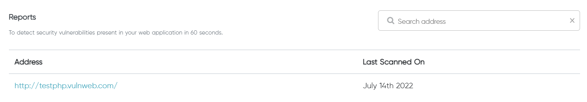
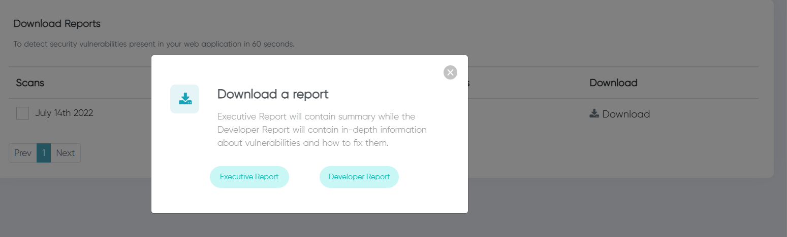

## Report Page

The target website is displayed on the report page, along with the date it was last scanned. By clicking on the target, the user can download the report.

ReconwithMe automatically creates reports on your scan findings after it is completed. The tool generates the following two reports: Developer Report and Executive Report.

 ||| **Executive Report**
Executive Report contains a summary of vulnerabilities for observers. It consits of

- Overview: It consists of a piechart along with the number of high, medium, and low vulnerabilities.
- Vulnerabilities: It consists of name of vulnerability along with its type, status, and severity level.
- Conclusion: It consists of summary of the report.
- Recommendation: It consists of necessary measures that can be taken to address cyberthreats.

||| **Developer Report**
Developer Report contains detailed information about the vulnerability for the developers and IT experts. It consists of:

- Overview: It consists of a piechart along with the number of high, medium, and low vulnerabilities.
- Vulnerabilities: It consists of name of vulnerability along with its type, status, and severity level.
- Findings: It consists of description, impact, and remediation of each vulnerabilities in depth.
- Conclusion: It consists of summary of the report.
- Recommendation: It consists of necessary measures that can be taken to address cyberthreats.
|||

The Executive Report and Developer Report can be downloaded as needed via the report page's download button.

