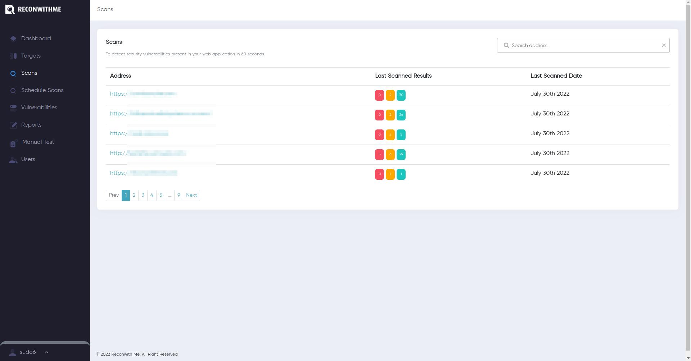
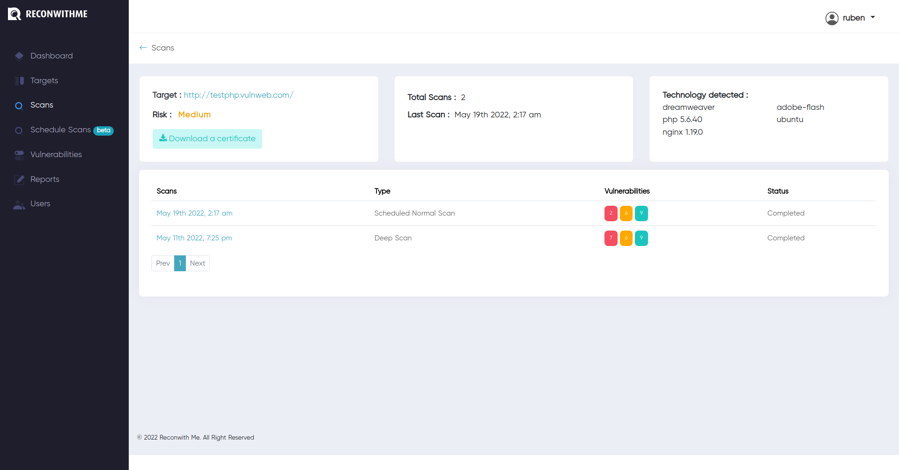
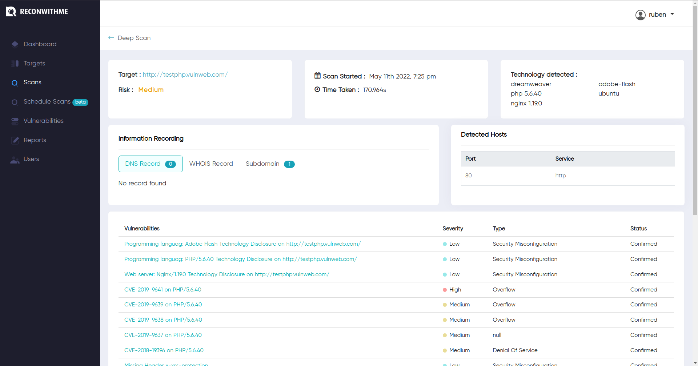

## Scans Page

Scan page displays all the scan history. You can search for the target and view all the scan history and all the vulnerabilities that was discovered on each scan. 

All the scanned targets, with their last scanned date and the number of vulnerabilities discovered are displayed on first page.

After selecting a targets from the list, you can view the scan history and the vulnerabilities that were discovered on each scan along with further details.

Finally upon clicking on specefic history, you can view the scan details and the vulnerabilities that were discovered.

