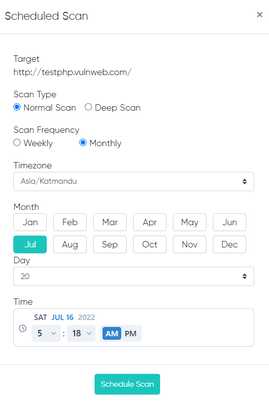
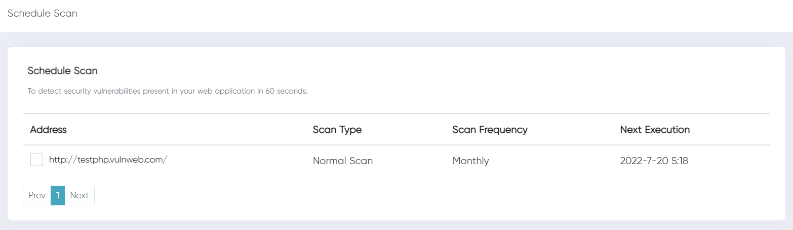

## Intro [!badge Beta]

You can schedule scan for any date and time as per your schedule, and once the scan is completed, the reports will be emailed immediately to your registered email address.
You can schedule your scan from the Schedule Scan page. 
- On schedule page, click on the `Add Schedule Scan` Button located on top right corner of the page.
- You will see a popup where you can choose the option as per your need. 

After the user has succefully added the details for the scan, the information will be added in the schedule page.
The schedule scan page consists of the details like Address, scan type, scan frequency, and next frequency. 

