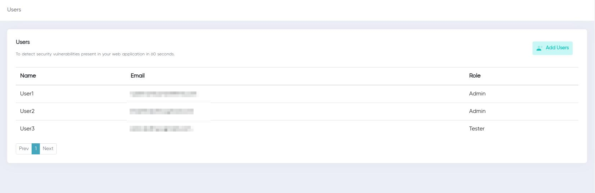

## Users Page

The user page includes the individual's name, email address, and role.

Users may have several domains, subdomains, and IP addresses; you may add more users and assign them the responsibility of scanning and managing certain targets/scopes using the add user function.

