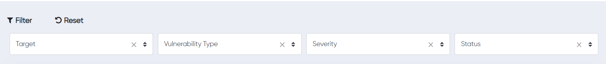
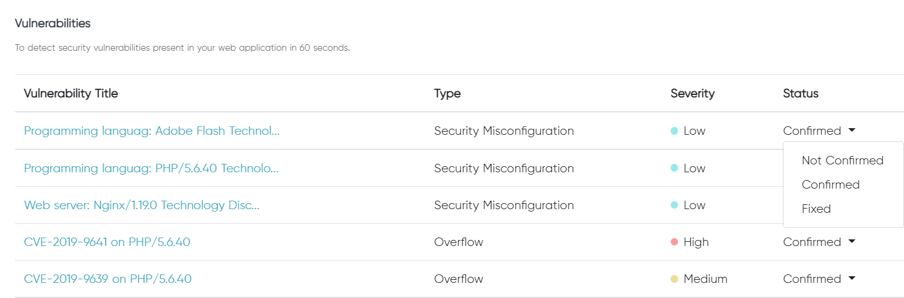

## Vulnerabilities Page
 
The vulnerability page displays the vulnerability found in the target website, as well as its name and severity rating.

It consists of filter and reset button. The filter is used to filter the table by certain type, severity and so on and the reset is used to reset the table to its default. 

A column is displayed in the vulnerability section, where vulnerability title, Type, Severity, and status is displayed. 

> ||| **Vulnerability Title**
> It displays the name of the vulnerability or its CVE ID and name.
> ||| **Type**
> It displays the type of vulnerability that has been discovered. For example, Web server: Nginx/1.19.0 Technology is a Security Misconfiguration. 
> ||| **Severity**
> It displays the severity of the vulnerability if it is High, Medium, or Low on the basis of the vulnerability discovered. 
> ||| **Status**
> It consist of three status. The user can change the status if the vulnerability has been Confirmed, Not Confirmed, or Fixed.
> |||

The security vulnerabilities present in your web application is detected 60 seconds and a table is generated as shown below. 

