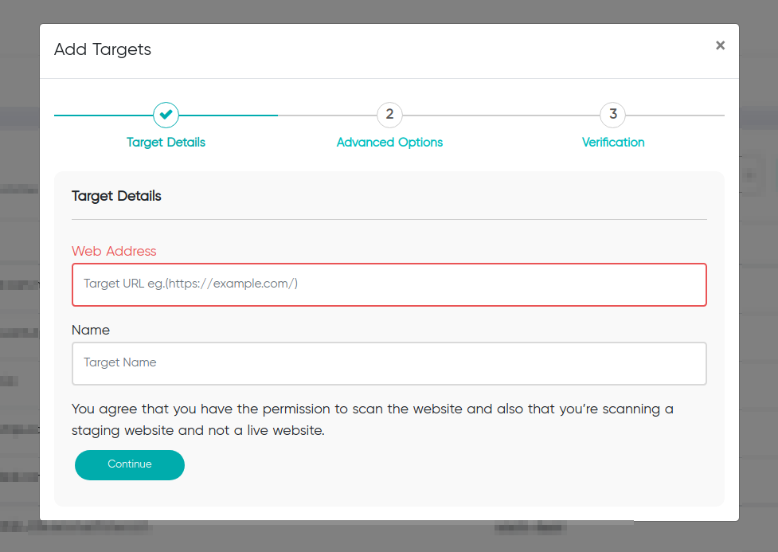
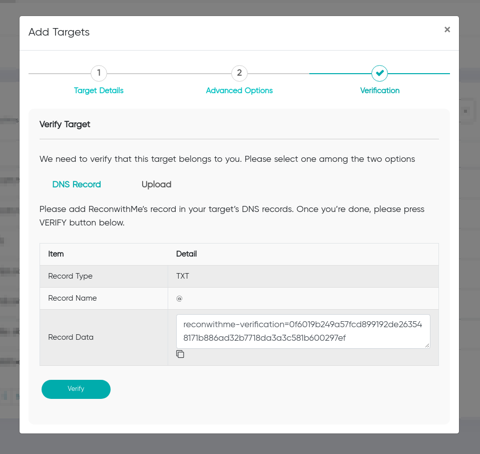
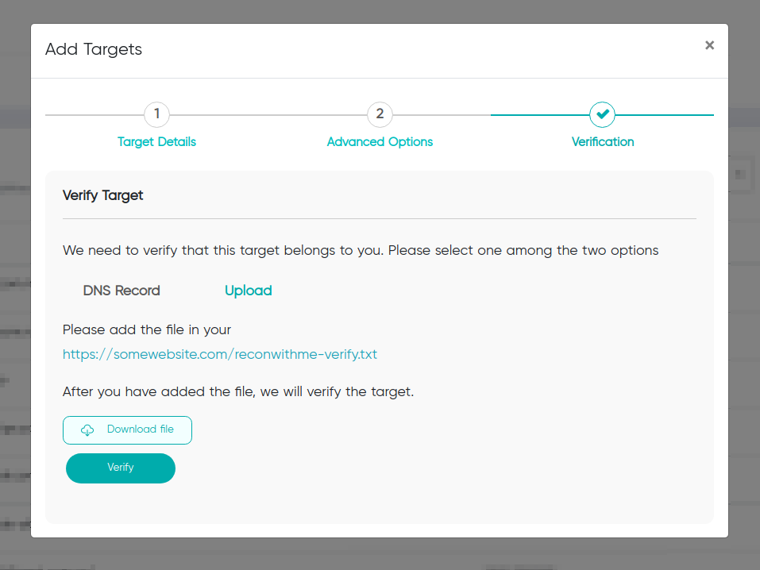

Target is a url that you want to scan for vulnerabilities.

## Adding a new target

To add a target navigate to `Targets > Add Target`

After entering the `target url` and `target name`, you can proceed by clicking next, upon which you can add advance information of the target for customized scan. 

You can also choose to skip advance options and click on next to proceed. 

!!!
This will scan the target with default settings.
!!!

### Verifying a target
After providing the required information, you should verify the target belongs to you.

#### DNS record
By adding `DNS TXT Record` shown on popup to the target domain, you can verify that the target belongs to you. 

#### File upload
Download the text file provided by on popup and upload it on the root directory of your target domain.

Upon clicking verify your target should be verified.